# 计算机网络

**计划十天学一章**

## 第一章：计算机网络的概念

### 第一天：6.23 [1.0-1.1.3.1]

#### 1.计算机网络的概念

##### 集线器

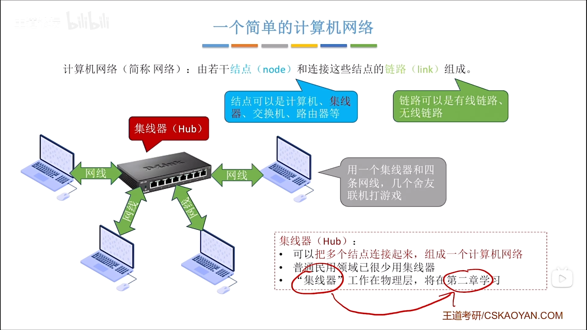

##### 交换机

##### 路由器(PS:不是家用路由器)

##### 网络服务提供商(ISP)&互联网

##### 总结

#### 2.电路交换，报文交换，分组交换⭐

##### 电路交换技术(早期电话网络)

##### 报文交换技术(借鉴早期的电报网络)

##### 分组交换技术

##### "虚电路交换"技术(基于分组交换)

**基于分组交换，加上电路交换技术建立连接的过程 **

###  第二天：6.25 [1.1.3.2-1.1.5.2]

#### 1.三种交换方式的性能分析⭐

##### 电路交换

##### 报文交换

##### 分组交换

#### 2.计算机网络的分类

##### 按分布范围分类

##### 按传输技术分类

##### 按拓扑结构分类

##### 按使用者分类

#### 3.计算机网络的性能指标⭐

##### 速率

##### 带宽

##### 吞吐量

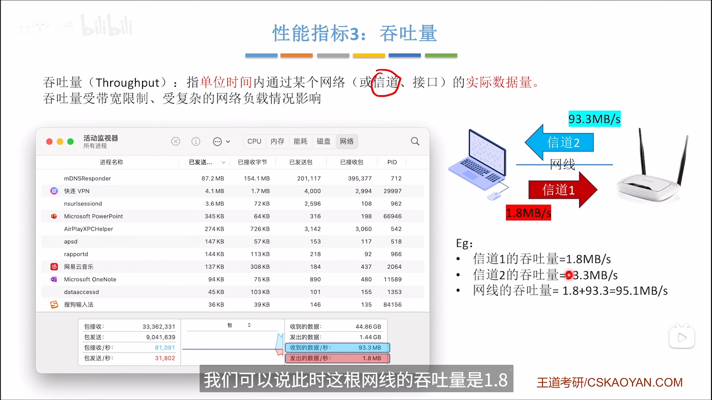

##### 时延

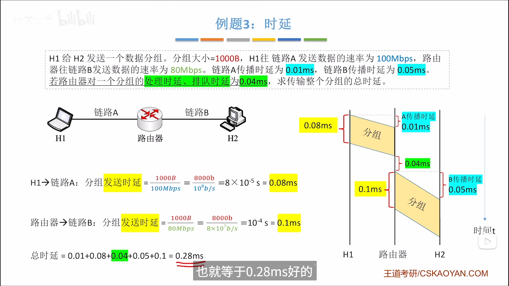

##### 时延带宽积

##### 往返时延RTT

##### 信道利用率

### 第三天：6.26 [1.2.1-1.2.3.1]

#### 1.计算机网络分层结构

##### 引子:快递网络的五层体系结构

##### 计算机网络体系结构

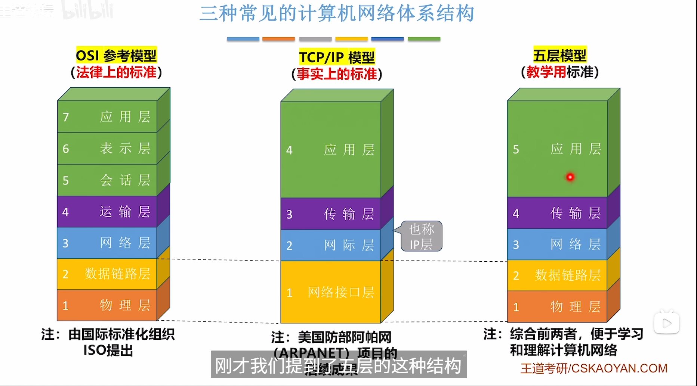

##### 网络体系结构的概念

##### 各层之间的关系

###### 水平关系

###### 垂直关系

##### 数据的传输过程

###### 水平视角

###### 垂直视角

##### PDU,SDU,PCI

##### 协议的三要素

##### 总结

#### 2.OSI参考模型

**物联网叔会使用**

##### #1物理层

##### #2链路层

##### #3网络层

##### #4传输层

##### #5~#7

##### 总结：各层数据传输单位⭐

### 第四天：7.10 [1.2.3.2-2.1.3.2]

#### 1.TCP IP模型

##### #1网络接口层

##### #2网络层

##### #3传输层

##### #4应用层

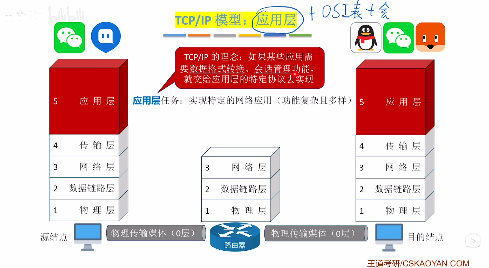

##### OSI模型 VS TCP/IP模型

##### 总结

## 第二章：物理层

#### 1.通信基础的基本概念

##### 信源，信宿，信号，信道

##### 信号:数字信号，模拟信号

##### 码元⭐

###### 码元与比特的关系

##### 速率：波特率和比特率⭐

##### 总结

#### 2.信道的极限容量

##### 带宽(回顾)

##### 噪声

##### 奈奎斯特定理⭐

###### 例题

##### 香农定理⭐

###### 信噪比

###### 例题

##### 奈奎斯特定理&香农定理⭐

##### 总结

##### *太阳风暴

#### 3.编码与调制

##### 编码&解码，调制&解调

##### 常见的编码方法⭐

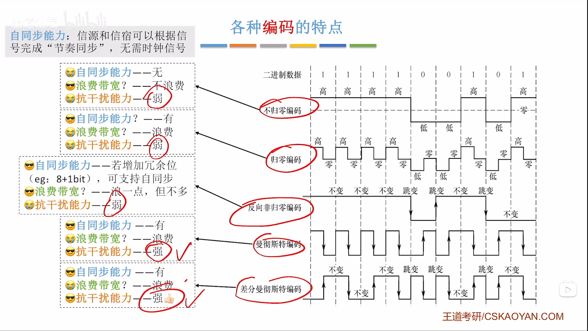

###### 例题

##### 常见的调制方法⭐

###### 让一个码元携带更多比特

###### 例题

##### 总结

### 第五天：7.20 [2.2-3.3.1.2]

#### 4.传输介质

##### 导向型

###### 双绞线

###### 同轴电缆

###### 光纤

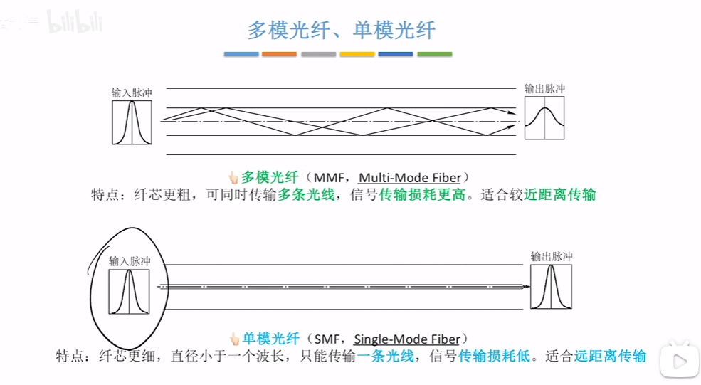

##### 以太网对有线传输介质得命名规则

##### 无线传输介质

###### 微波通信(卫星通行)

##### 物理层接口的特性

##### 小结

#### 5.物理层设备

##### 中继器(Repeater)

##### 集线器(Hub)

###### 冲突域

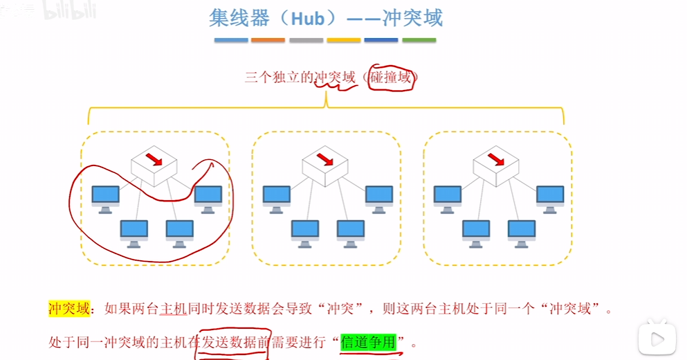

###### 例题

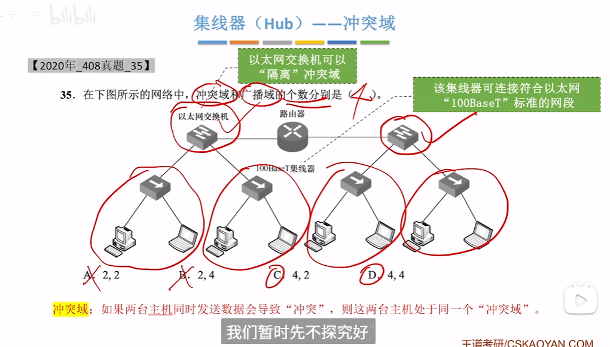

##### 集线器，中继器的一些特征

##### 小结

## 第三章：数据链路层

#### 数据链路层的功能

#### 1.组帧

##### 字符计数法

**-发送方在帧的数据部分的开头加一个定长计数字段(一般是八位)表示这个帧的字节数([1,255])，这个长字节数包括计数字段本身。**

**-接收方通过识别这个计数字段确认帧长**

##### 字节填充法

**SOH：Start Of Header**

**EOT：End Of Transmission **

**-发送方在帧的数据部分的开头加上SOH字符以及在尾部加上EOT，分别作为帧的开头和结尾。若帧的数据部分出现SOH和EOT字符，则在其前面加一个ESC转义字符表示这是数据而不是SOH或EOT控制字符；若帧的数据部分出现ESC处理方法也是在其前面加一个ESC转义字符。**

**-接收方通过识别SOH和EOT确认一个帧的边界,每次遇到ESC都会将其后方的一个字节认为是数据而不是控制字符或转义字符。**

##### 零比特填充法

**-发送方在帧的数据部分的开头和结尾加上`01111110`表示帧开始和帧结束。若数据部分出现连续的`5`个`1`，发送方会在后面追加一个`0`，这样就不会出现连续的`6`个`1`，意义是与帧开始和帧结束字符区分。**

**-接收方发现帧的数据部分中存在连续的`5`个`1`，就会把其后的发送方追加的`0`删除，把帧恢复成原始的数据**

##### 违规编码法

**数据链路层不做任何处理，数据链路层把帧交给物理层，以物理层信号不跳变的某一周期作为帧的开始或结束，此法需要曼彻斯特编码配合**

##### 小结

#### 2.差错控制

##### 检错编码 

###### 奇偶校验码

###### 循环冗余校验码(CRC码)

*循环的出处*

**前一个出错位得余数除以1101得出来的后一个出错位的余数**

##### 纠错编码

###### 海明校验码

### 第六天：7.22 [3.3.2-3.4.5]

#### 3.流量控制与可靠传输

##### 滑动窗口机制

##### 停止-等待协议(S-W)

**S：Stop，W：Wait**

###### 数据帧，确认帧，帧序号

###### 正常情况

**发送方发送一个数据帧`Data1`，随后接收方接收到`Data1`，接收方的滑动窗口后移，然后发送一个确认帧`ACK1`，发送方接收到确认帧`ACK1`之后滑动窗口后移进行后续数据帧的发送**

###### 数据帧丢失

**发送方发送`数据帧`时会同时设置一个计时器，若`数据帧`因网络噪声等原因丢失导致接收方没有收到`数据帧`，此时计时器会因长时间没收到`确认帧`而再次发送`数据帧`，直到发送方收到`确认帧`才会窗口后移进行后续发送。**

###### 确认帧丢失

**发送方发送`数据帧1`，接收方接收到`数据帧1`，接收方的窗口后移，与此同时发送一个`确认帧1`。若因网络原因导致`确认帧1`丢失，导致发送方计时器超时，发送方会再次发送`数据帧1`，因为接收方需要的是`数据帧2`且已经接收过了`数据帧1`，所以接收方会丢弃`数据帧1`并再次给发送方发送一个`确认帧1`**

*<b>帧受损</b>的情况和确认帧丢失的情况类似 ，就是接收方发现帧错误，随后丢弃帧，不返回确认帧*

###### 给帧编号的原因

###### 小结

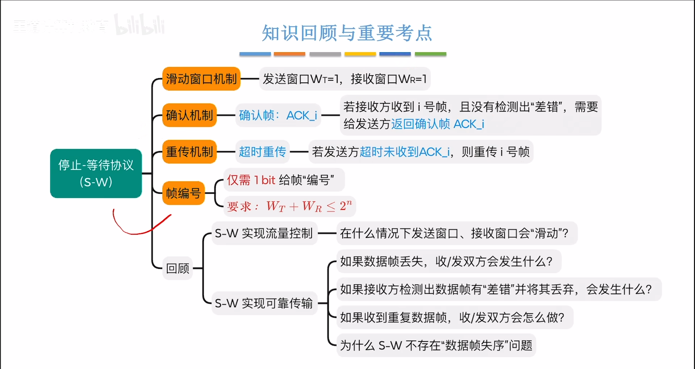

#####  后退N帧协议(GBN)

**GBN：Go-Back-N**

###### 正常情况

###### 数据帧丢失

**在数据帧`E`传输时出现问题导致接收方没有收到`E`，但是发送方还会继续发送数据帧`F`,此时接收方收到窗口之外的帧`F`，直接丢弃并返回最后一个正确接收到的帧的确认帧`D`，随后发送方会从`D`之后的帧开始重新传**

###### 确认帧丢失

**接收方接收到所有帧时会返回确认帧`ACK2`，但是因网络原因发送方没有收到`ACK2`，于是会重新发送帧`ABC`，此时接收方收到窗口之外的帧会返回最后一个正确收到的帧`C`的确认帧`ACK2`。发送方收到`ACK2`后得知`ABC`已经成功发送则会滑动窗口至后续帧**

###### 为什么要Wt + Wr <= 2^n?

$$
W_T + W_R \leq 2^n
$$

###### 小结

##### 选择重传协议(SR)

**SR：Selective Repeat**

###### 正常境况

###### 数据帧丢失

###### 数据帧错误

###### 确认帧丢失

###### 为什么要Wt + Wr <= 2^n?

###### 小结

##### 三种协议的信道利用率⭐

###### S-W协议的信道利用率

###### GBN，SR协议的信道利用率

**滑动窗口协议**

**ARQ协议，连续ARQ协议**

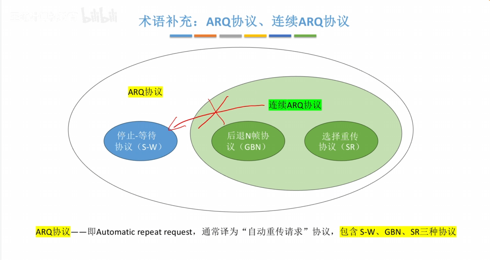

###### 小结

### 第七天：7.25 [3.5.1.1-3.5.1.2]

#### 4.介质访问控制

##### 信道划分

###### 时分复用(TDM)

###### 频分复用(FDM)

###### 码分复用(CDM)

###### 小结

### 第八天：7.27 [3.5.2.1-3.5.3]

##### 随机访问

###### ALOHA协议

**ALOHA：Additive Links On-line Hawaii Area(夏威夷地区在线附加链路)**

**纯ALOHA**

**时隙ALOHA**

###### CSMA协议

**CSMA：Carrier Sense Multiple Access（载波侦听多路访问）**

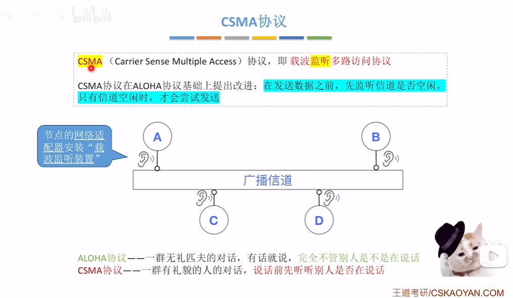

**1-坚持CSMA协议**

**非坚持CSMA协议**

**p-坚持CSMA协议**

###### ALOHA和CSMA小结

###### CSMA/CD协议

**CD：Collision Detection(冲突检测)**

**关于争用期**

**关于最短帧长**

###### CSMA/CA协议

**CA：Collision Avoidance(冲突避免)**

**AP**

**信道预约机制**

**例题**

##### 轮询访问

###### MAU：令牌环网的集中控制站

###### 小结

### 第九天：7.30 [3.6.0-3.8]

#### 5.局域网与IEEE 802

##### IEEE组织

##### 局域网(LAN)

**LAN：Local Area Network**

###### 有线局域网(IEEEE 802.3)

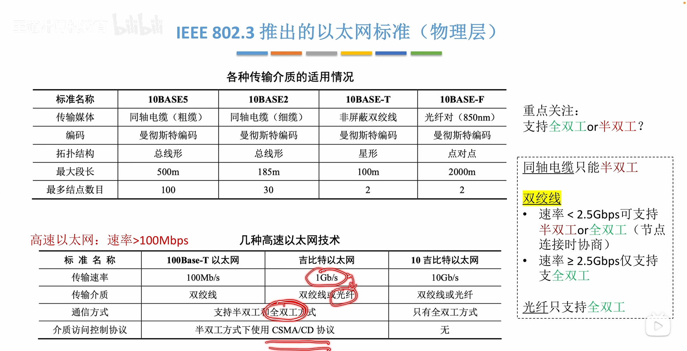

**同轴电缆-半双工**

**双绞线-半双工&全双工**

###### VLAN(IEEE 802.1Q)

**802.1Q帧的结构**

**小结**

###### 无线局域网(IEEEE 802.11)

**网桥(Portal)**

**802.11无线局域网的基本概念**

**802.11帧**

**例题**

**小结**

***拓展**

##### 广域网(WAN)

没有

##### 以太网交换机

###### 自学习功能

###### 两种交换方式

###### 小结

## 第四章：网络层

### 第十天：

#### 1.